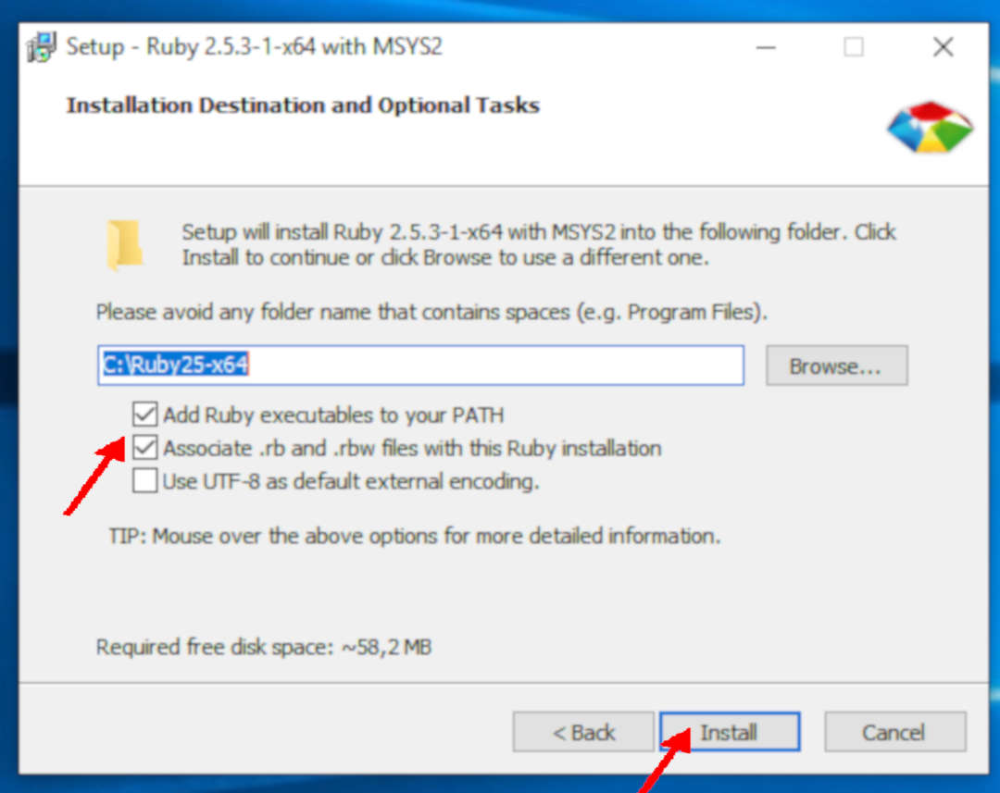
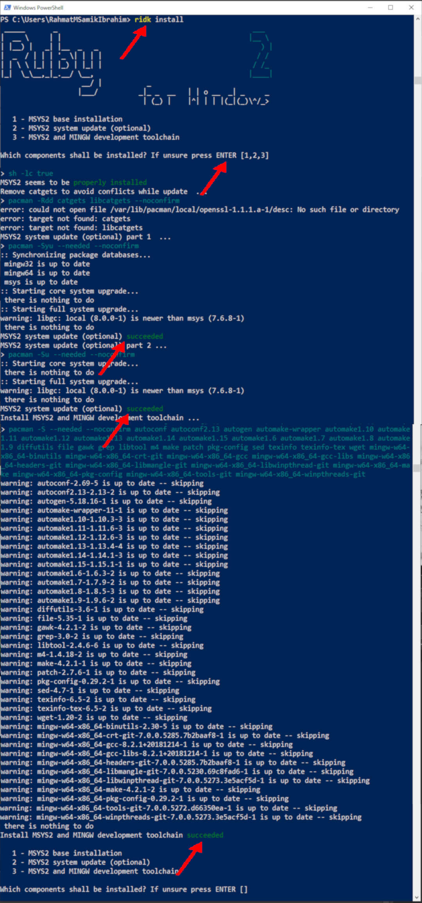
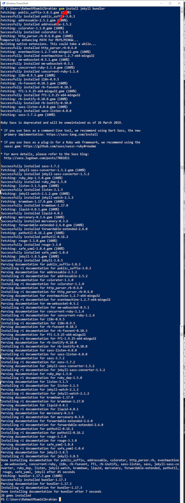
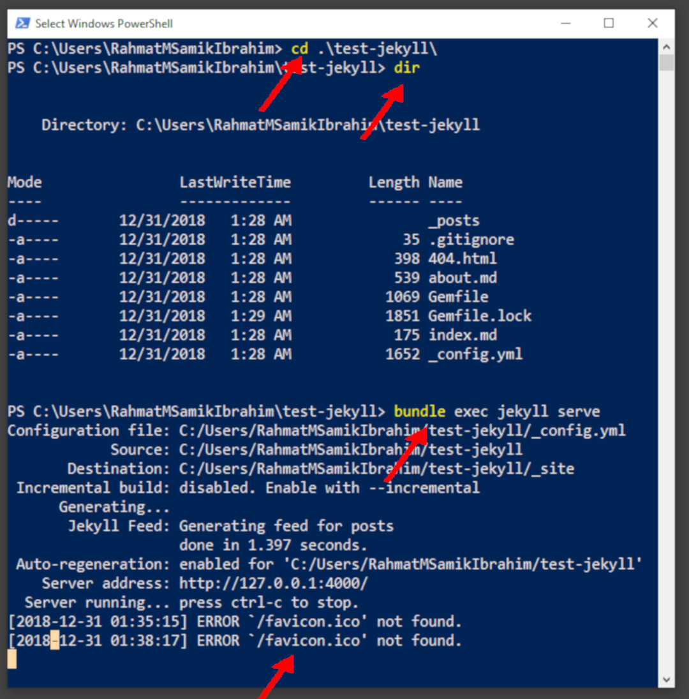
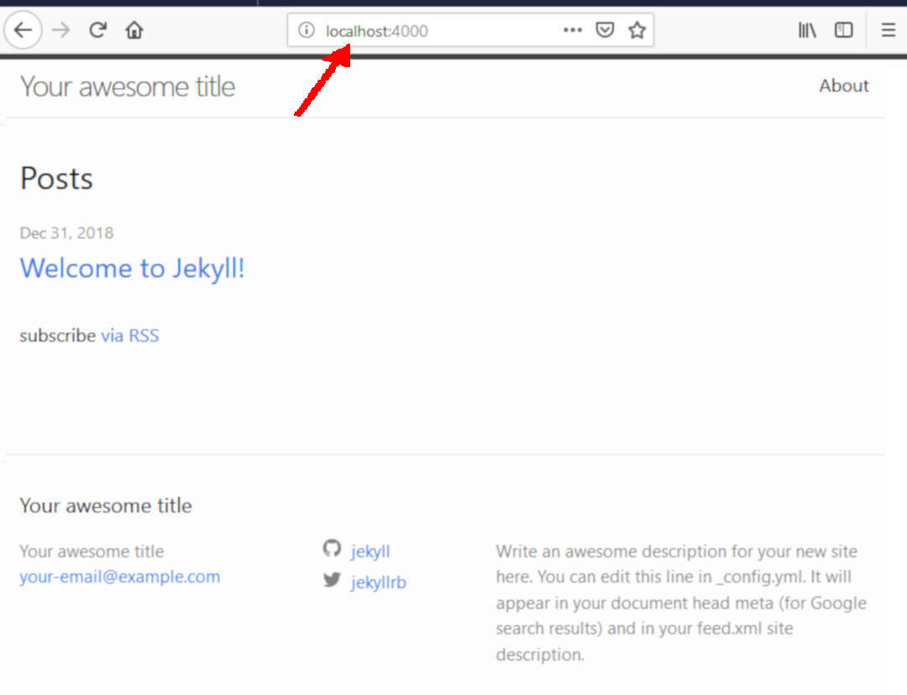

# Jekyll for Windows 10

## (01) = = =

## (02) = = =

## (03) = = =

## (04) = = =

## (05) = = =

## (06) = = =

## (07) = = =

## (08) = = =

## (09) = = =

## (10) = = =

## (11) = = =

## (12) = = =

## (13) = = =

## (14) = = =

## (17) = = =

## (18) = = =

## (19) = = =

## (20) = = =

## (21) = = =

## (22) = = =

## = = = = = = [NEXT: GitHub Pages 2 Jekyll ](https://rms46.github.io/webweb9/) = = = = = =
